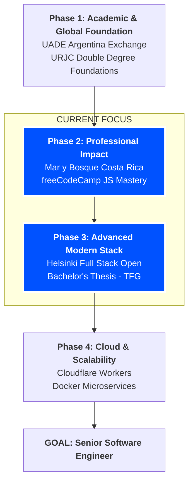

# Hi there, I'm Jon Mazcuñán Hernández! 👋

### 👨‍💻 Computer Science & Software Engineering Student
**Expected Graduation: 2027 | Universidad Rey Juan Carlos (Madrid)**

I am a results-driven Engineer finishing my **Double Degree**. I specialize in building efficient, scalable software and solving real-world business logic through clean code. Currently seeking a **Software Engineering Internship** to apply my international experience and technical rigour.

---

## 🗺️ Engineering Certification & Career Roadmap
*Mapping my transition from Academic Excellence to Industry Seniority.*

---

## 📍 Roadmap Breakdown

* **DONE ✅ | Foundation**
    * **Academic Excellence:** Completed a 1-year academic exchange at **UADE (Argentina)**.
    * **CS Core:** Mastered fundamentals at URJC (Advanced Algorithms, OS, and SQL).

* **IN PROGRESS 🚀 | Practical Mastery**
    * **freeCodeCamp:** JavaScript Algorithms and Data Structures certification.
    * **Full Stack Open (Helsinki):** High-priority Full Stack Web Development training.
    * **CS50P (Harvard):** Advanced Programming with Python.
    * **MIT Academy:** "The Missing Semester of Your CS Education" for advanced productivity.

* **UP NEXT 📅 | Specialization & FAANG Prep**
    * **AWS Cloud Practitioner Essentials:** Specialized training in Cloud Infrastructure.
    * **NeetCode Roadmap:** Advanced Algorithms and Data Structures for **FAANG-level** interview preparation.
    * **Bachelor’s Thesis (TFG):** Research and development of a high-performance system.

* **TARGET 🎯 | Excellence**
    * **Career Goal:** Becoming a **Senior Software Engineer** in a high-growth Fintech or Infrastructure company.

---

## 🌍 International Experience & "In the Trenches" Engineering
* **🇦🇷 Academic Exchange (1 Year):** Studied at **UADE (Buenos Aires, Argentina)**, expanding my perspective on global tech environments and software development methodologies.
* **🇨🇷 Professional Volunteering (Costa Rica):** Spent one month in **Bahía Drake** spearheading digitalization projects. I helped local businesses transition to the digital world through web development and process optimization.
* **💼 Mar y Bosque (Professional Project):** Developed and deployed a full-scale ERP and booking system for a Costa Rican tourism company. From daily stakeholder meetings to final production deployment.

---

## 🛠️ Technical Stack & Learning Roadmap
* **Languages:** JavaScript (ES6+ Expert), Java, SQL, C, Python.
* **Infrastructure:** **Docker** (Microservices enthusiast), Git/GitHub Actions, Linux Terminal.
* **Frontend:** HTML5, CSS3, Web APIs (Currently mastering **React** via Helsinki Full Stack Open).
* **Methodologies:** TDD (Test Driven Development), Agile/Scrum, Requirements Engineering.

---

## 📈 What I'm working on right now:
* **DONE ✅ | Phase 1:** Advanced Algorithms, Operating Systems, and SQL at URJC.
* 🚀 **freeCodeCamp Mastery:** Completing the 1,056-step JavaScript Algorithms & Data Structures certification.
* 🎓 **Final Lap:** Preparing for my Bachelor’s Thesis (TFG) and looking for a high-impact Summer Internship.

---

## 🎯 Connect with me:
* 💼 [LinkedIn](https://www.linkedin.com/in/jon-mazcu%C3%B1%C3%A1n-hern%C3%A1ndez-701308346/)
* 📧 [Email Me](mailto:jonmazh@gmail.com)
* 🌍 Based in Madrid | Open to relocation (Lisbon, London, Amsterdam, Berlin)

---

### ⚡ Fun Fact & Personal Interests
When I'm not architecting systems or debugging code, you can find me:
* 🏋️‍♂️ **Training at the gym:** I value discipline and consistency, both in my code and my physical health.
* ☀️ **Outdoors:** I love spending time in parks and catching some sun to recharge.
* 📺 **Series enthusiast:** Big fan of good storytelling and binge-watching great series.
* 🎵 **Music:** My soundtrack usually fluctuates between the soul of **Flamenco** and the energy of **Rap**.

I believe that a balanced life and a curious mind are what make a great engineer.
